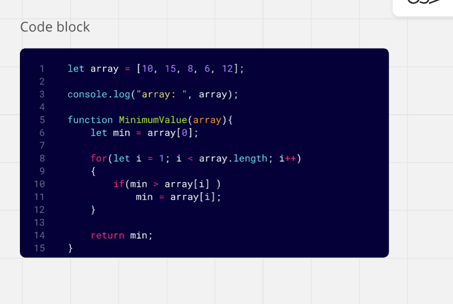
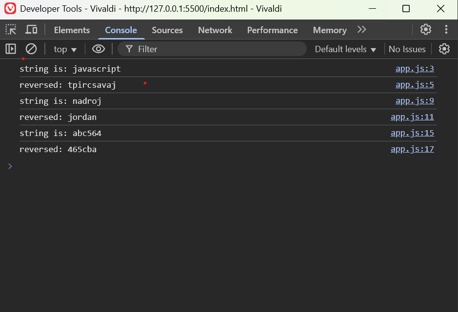
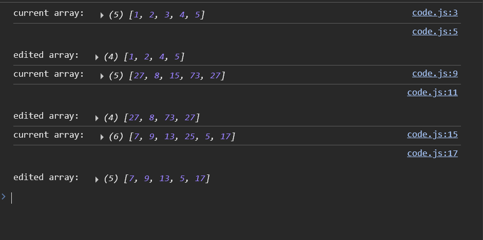

### Whiteboard Challanges

### Challanges A: Array reversal

#### A function that takes an array and reverses its content.

### Challanges B: Most Frequant Number

#### A function that takes an array and returns the most occuring number in it.

### Challenge 02: Minimum Value

#### A function that takes an array and returns the minimum number in it.

### Challanges 03: Reverse Characters

#### A function that takes a string and reverses its content and returns it.

### Challange 04: Remove Middle Value

#### A function that takes an array and removes the middle value from it.

